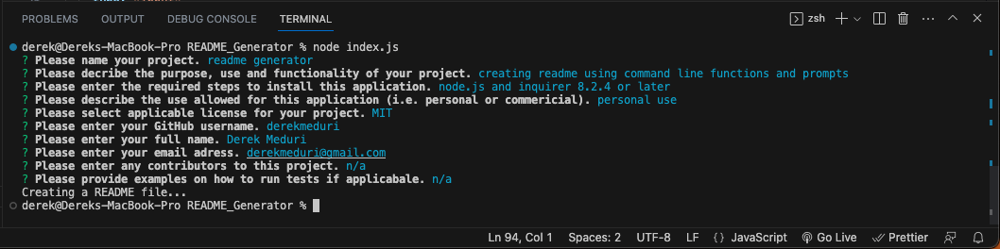
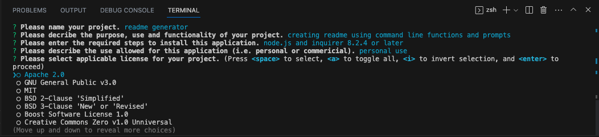
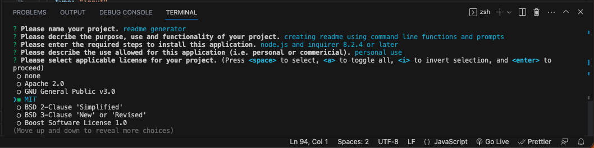
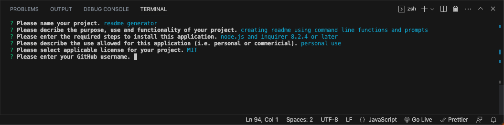

# README Generator

    ## Table of Contents

- - [Description](#Description)

- - [Installation](#Installation)

- - [Usage](#Usage)

- - [Questions](#Questions)

- - [Contributors](#Contributors)

- - [Testing](#Testing)

- - [License](#License)

    ## Link

    [Demo Link](https://drive.google.com/file/d/17YOr0eplXwdNldBIQBEgW6lJ7nV1G3FL/view)

    

    [Github Repository](https://github.com/derekmeduri/README_Generator)

    ## Screenshots

    Preview of finished questions in terminal:
    

    When selecting a license use the arrow keys to navigate between choices, then hit spacebar to make a selection and finally hit enter to move on to next prompt.

    
    
    

    ## Description

    Creating README.md files with command line functions and prompts.

    ## Installation

    node.js, inquirer 8.2.4 (or later) and using the terminal functions node index.js

    ## Usage

    personal use only

    ## Questions

    Please reach out if you have any questions regarding this application.

    - Name - Derek Meduri
    - Email - derekmeduri@gmail.com
    - GitHub - [derekmeduri](https://github.com/derekmeduri/)

    ## Contributors

    n/a

    ## Testing

    n/a

    ## License

    Licensed under MIT License.
